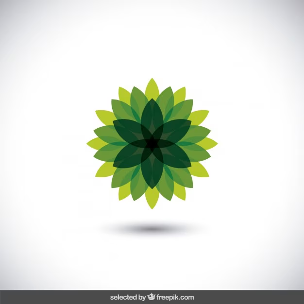

# Ex02 Commercial Website
## Date: 09-05-2026

## AIM
To create a commercial website using CSS Flexbox.

## ALGORITHM
### STEP 1
Create an HTML file (index.html)

### STEP 2
Create a CSS file (style.css)

### STEP 3
Include a navigation bar with links to different sections.

### STEP 4
Add structured sections for Homepage, Products / Services, About Us, Contact Details and User Account.

### STEP 5
Include social media links at the footer with copyright information.

### STEP 6
Define global styles for fonts, colors, and layout.

### STEP 7
Style the header, navigation bar, and sections.

### STEP 8
Use Flexbox for layout design.

### STEP 9
Add hover effects and transitions for interactivity.

### STEP 10
Add Images and Media.

### STEP 11
Use optimized images for a professional look.

### STEP 12
Open the HTML file in a browser to check layout and functionality.

### STEP 13
Fix styling issues and refine content placement.

### STEP 14
Deploy the website.

### STEP 15
Upload to GitHub Pages for free hosting.

## PROGRAM

# Index.html
```

<!DOCTYPE html>
<html lang="en">
<head>
    <meta charset="UTF-8">
    <meta name="viewport" content="width=device-width, initial-scale=1.0">
    <title>Golden Petal</title>
    <link rel="stylesheet" href="style.css">
</head>
<body>
    <!-- Navbar -->
    <nav>
        <div class="logo">
            
            <h2>Golden Petal</h2>
        </div>
        <ul>
            <li><a href="#">Home</a></li>
            <li><a href="#">About</a></li>
            <li><a href="#">Products</a></li>
            <li><a href="#">Contact</a></li>
        </ul>
    </nav>
    <!-- Hero Section -->
    <section class="hero">
        <div class="hero-content">
            <h1>Fresh Flowers</h1>
            <h3>Natural & Beautiful Flowers</h3>
            <p>
                Natural & Beautiful Flowers for every celebration and special occasion.
            </p>
            <button>Shop Now</button>
        </div>
    </section>
    <!-- Products -->
    <section class="products">
        <h2>Premium Flower Collection</h2>
        <div class="product-container">
            <!-- Product 1 -->
            <div class="card">
                
                <div class="card-content">
                    <h3>Rose</h3>
                    <p>
                        Fresh premium roses with natural fragrance.
                    </p>
                    <h4>₹499</h4
                    <button>Add to Cart</button>
                </div>
            </div>
            <!-- Product 2 -->
            <div class="card">
                
                    <h3>Yellow Rose</h3>
                    <p>
                        Elegant yellow roses for joyful celebrations.
                    </p>
                    <h4>₹699</h4>
                    <button>Add to Cart</button>
                </div>
            </div>
            <!-- Product 3 -->
            <div class="card">
                
                <div class="card-content">
                    <h3>Lotus</h3>
                    <p>
                        Traditional lotus flowers with fresh aroma.
                    </p>
                    <h4>₹599</h4>
                    <button>Add to Cart</button>
                </div>
            </div>
        </div>
    </section>
    <!-- About -->
    <section class="about">
        <h2>About Golden Petal</h2>
        <p>
            Golden Petal provides fresh and premium flower collections for weddings,
            birthdays and special celebrations. Every flower is carefully selected
            to give beauty, fragrance and elegance.
        </p>
    </section>
    <!-- Footer -->
    <footer>
        <div class="footer-container">
            <div class="footer-box">
                <h3>Golden Petal</h3>
                <p>
                    Premium flowers crafted with elegance.
                </p>
            </div>
            <div class="footer-box">
                <h3>Quick Links</h3>
                <ul>
                    <li>Home</li>
                    <li>About</li>
                    <li>Products</li>
                    <li>Contact</li>
                </ul>
            </div>
            <div class="footer-box">
                <h3>Contact Us</h3>
                <p>Email: goldenpetal@gmail.com</p>
                <p>Phone: +91 9876543210</p>
            </div>
        </div>
        <div class="footer-bottom">
            Name: Keshavarthini B | Register No: 212224040158
        </div>
    </footer>
</body>
</html>
```
# style.css
```

*{
    margin: 0;
    padding: 0;
    box-sizing: border-box;
    font-family: Arial;
}

body{
    background-color: #f5f5f0;
    color: #0b3d2e;
}

/* Navbar */

nav{
    width: 100%;
    background-color: #f5f5f0;
    padding: 15px 60px;

    display: flex;
    justify-content: space-between;
    align-items: center;

    box-shadow: 0px 2px 10px rgba(0,0,0,0.1);

    position: fixed;
    top: 0;
    z-index: 1000;
}

.logo{
    display: flex;
    align-items: center;
    gap: 10px;
}

.logo img{
    width: 70px;
    height: 70px;
    object-fit: contain;
}

.logo h2{
    color: #0b3d2e;
    font-size: 28px;
}

nav ul{
    list-style: none;

    display: flex;
    gap: 30px;
}

nav a{
    text-decoration: none;
    color: #0b3d2e;
    font-weight: bold;
}

/* Hero Section */

.hero{
    margin-top: 100px;
    height: 500px;

    background-image: url('hero.png');
    background-size: cover;
    background-position: center;

    display: flex;
    align-items: center;
    padding-left: 80px;
}

.hero-content{
    background-color: rgba(255,255,255,0.85);
    padding: 30px;
    border-radius: 10px;
    width: 450px;
}

.hero-content h1{
    font-size: 45px;
    margin-bottom: 15px;
}

.hero-content h3{
    color: #444;
    margin-bottom: 15px;
}

.hero-content p{
    font-size: 18px;
    margin-bottom: 20px;
    color: #444;
}

.hero-content button{
    padding: 10px 20px;
    border: none;
    background-color: #0b3d2e;
    color: white;
    cursor: pointer;
    border-radius: 5px;
}

/* Products */

.products{
    padding: 70px 40px;
    text-align: center;
}

.products h2{
    font-size: 35px;
    margin-bottom: 40px;
    color: #0b3d2e;
}

.product-container{

    display: flex;
    justify-content: center;
    gap: 30px;
    flex-wrap: wrap;
}

.card{
    width: 280px;
    background-color: #f5f5f0;
    border-radius: 10px;
    overflow: hidden;

    box-shadow: 0px 6px 18px rgba(11,61,46,0.25);
}

.card img{
    width: 100%;
    height: 250px;
    object-fit: cover;
}

.card-content{
    padding: 20px;
}

.card h3{
    margin-bottom: 10px;
}

.card p{
    font-size: 14px;
    margin-bottom: 15px;
    color: #555;
}

.card h4{
    margin-bottom: 15px;
}

.card button{
    padding: 10px 18px;
    border: none;
    background-color: #0b3d2e;
    color: white;
    border-radius: 5px;
    cursor: pointer;
}

/* About */

.about{
    padding: 70px 40px;
    text-align: center;
    background-color: #e8f1ec;
}

.about h2{
    margin-bottom: 20px;
    font-size: 35px;
}

.about p{
    width: 70%;
    margin: auto;
    line-height: 1.8;
}

/* Footer */

footer{
    background-color: #0b3d2e;
    color: white;
    padding: 50px 30px;
}

.footer-container{
    display: flex;
    justify-content: space-around;
    flex-wrap: wrap;
    gap: 30px;
}

.footer-box h3{
    margin-bottom: 15px;
}

.footer-box ul{
    list-style: none;
}

.footer-box li{
    margin-bottom: 10px;
}

.footer-bottom{
    text-align: center;
    margin-top: 30px;
    border-top: 1px solid gray;
    padding-top: 20px;
}

/* Responsive */

@media screen and (max-width: 768px){

    nav{
        flex-direction: column;
        gap: 15px;
        padding: 15px;
    }

    .hero{
        padding: 20px;
        justify-content: center;
        text-align: center;
    }

    .hero-content{
        width: 100%;
    }

    .hero-content h1{
        font-size: 30px;
    }

    .about p{
        width: 100%;
    }
}
```
## OUTPUT


## RESULT
The program for creating commercial website using CSS Flexbox is executed successfully.
